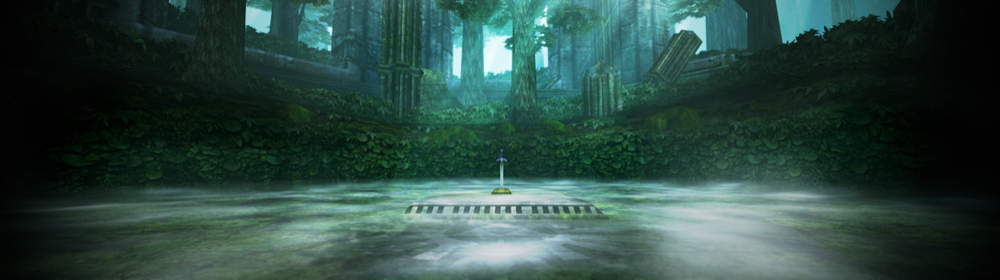

  

 

Aurora is a source-level GameCube & Wii compatibility layer intended for use with game decompilation projects.

Originally developed for use in [Metaforce](https://github.com/AxioDL/metaforce), a Metroid Prime reverse engineering project.
It now powers several completed source ports, including [Dusklight](https://github.com/TwilitRealm/dusklight).

### Features

- Application layer using SDL3
  - Runs on Windows, Linux, macOS, iOS, tvOS, Android
- GX compatibility layer
  - Graphics API support: D3D12, Vulkan, Metal
  - Highly accurate and performant GX implementation
  - Robust pipeline cache system with "transferable" cache support for releases
  - Dolphin-compatible texture pack support
  - Widescreen & resolution scaling support
  - Custom APIs for offscreen rendering
- PAD compatibility layer
  - Utilizes `SDL_Gamepad` for wide controller support, including GameCube controller adapters
  - Automatically saves and loads controller bindings and port mappings
  - Gyro & mouse support
- DVD compatibility layer
  - Utilizes [nod](https://github.com/encounter/nod) to support all GameCube/Wii disc image types, including RVZ
- CARD compatibility layer
  - Full compatibility with Dolphin `.gci` and `.raw` for game saves
- [Dear ImGui](https://github.com/ocornut/imgui) built-in for simple debug UIs
- [RmlUi](https://github.com/mikke89/RmlUi) built-in for full-fledged HTML/CSS-based UIs

### Graphics

The GX compatibility layer is built on top of [WebGPU](https://www.w3.org/TR/webgpu/), a cross-platform graphics API
abstraction layer. WebGPU allows targeting all major platforms simultaneously with minimal overhead. The WebGPU
implementation used is Chromium's [Dawn](https://dawn.googlesource.com/dawn/).

### Building

See [docs/building.md](docs/building.md) for build instructions, CMake integration, and configuration options.

### License

Aurora is licensed under the [MIT License](LICENSE).
