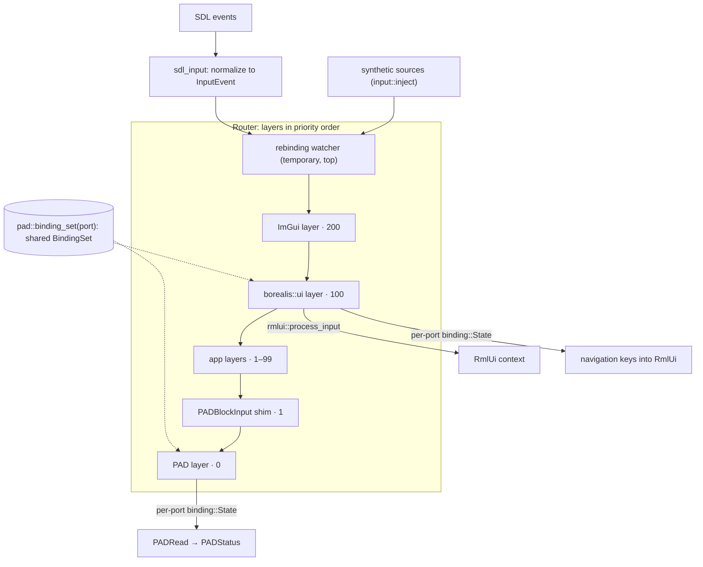

# Input routing and bindings

Aurora routes all primary-window input through one ordered chain of **layers**.
Each consumer maps what reaches it through its own **binding state**. When a UI
consumes or captures input, gameplay stops seeing it, whether gameplay polls
(`PADRead`) or reacts to events.

## Concepts

- **Sources.** There is one keyboard, one mouse and one touch source, one
  source per controller connection, and any synthetic sources. `SourceId`s are
  runtime identities and are never reused.
- **Consume vs. capture.** A layer's callback can *consume* a single event. Its
  capture query can instead *capture* a whole source, blocking every layer below
  it even when the callback passes. Capture is queried, not pushed: layers never
  sync flags into the router.
- **Routes.** Every layer that received a press or pointer-down also receives
  its repeats, motion and release. That holds even if a later event would have
  been consumed above it, so a release can't reach a layer that never saw the
  press. Axis samples, hover, scroll and text are routed per event.
- **Raw vs. admitted state.** The router keeps raw per-source state for
  diagnostics and legacy shims. Each `binding::State` sees only the input
  delivered to its layer. Gameplay never consults global held state.

## Reconciliation and capture transitions

Capture queries are re-evaluated before and after each routed event, at the end
of `aurora_update()`, and at the start of `PADRead`. So a menu opened by
`borealis::ui::update()` takes effect on the next PAD read, without needing a
new event.

| Transition | Effect on the newly blocked or unblocked layer |
| --- | --- |
| Capture begins | `Cancelled::All` for the source |
| Capture ends, or layer added/enabled | Held keys/buttons are not replayed. Sticks are resampled from raw state. Triggers wait for a near-neutral sample. |
| Focus lost / source removed | `Cancelled::All` with the matching reason |

Cancellations and changes made from inside callbacks are queued and delivered
after the current callback returns, never re-entrantly.

## Bindings and PAD

- `binding::register_control` names logical targets (`aurora.pad.a`,
  `metaforce.open_menu`, …). A `BindingSet` maps physical inputs on specific
  sources to those targets, and many `State`s can share one set.
- A `State` aggregates binding contributions and **producers**, which supply
  already-logical values such as touch controls or the `PADSetVirtualStatus`
  shim. Buttons are ORed; axes are summed and clamped. `MappingResult::targets`
  tells a UI whether an event hit a binding, and which control it targets.
- The PAD adapter builds one `BindingSet` per port from the existing mapping
  structs, keyboard mode and dead zones, plus any `pad::set_action_bindings`.
  It rebuilds when a snapshot of those inputs changes, because callers can
  mutate mappings through the pointers PAD returns. The PAD layer feeds a
  gameplay `State` per port, and `PADRead` just converts its values.
- The UI layer holds its own `State` per port over the same sets. It therefore
  sees R held when Start arrives, even though gameplay got R and not Start.

## Where things live

| Piece | Location |
| --- | --- |
| Public API | `include/aurora/{input,binding,pad}.hpp`, `rmlui::process_input` |
| Router, SDL normalization | `lib/input/router.cpp`, `lib/input/sdl_input.cpp` |
| Evaluator, shared source state | `lib/input/binding.cpp`, `lib/input/source_state.*` |
| PAD adapter | `lib/dolphin/pad/pad.cpp` |
| ImGui layer | `lib/imgui.cpp` |
| UI layer and navigation policy | `borealis::ui` (`src/ui/input.cpp`) |
| Tests | `tests/input_*_test.cpp`, `tests/pad_adapter_test.cpp` |
